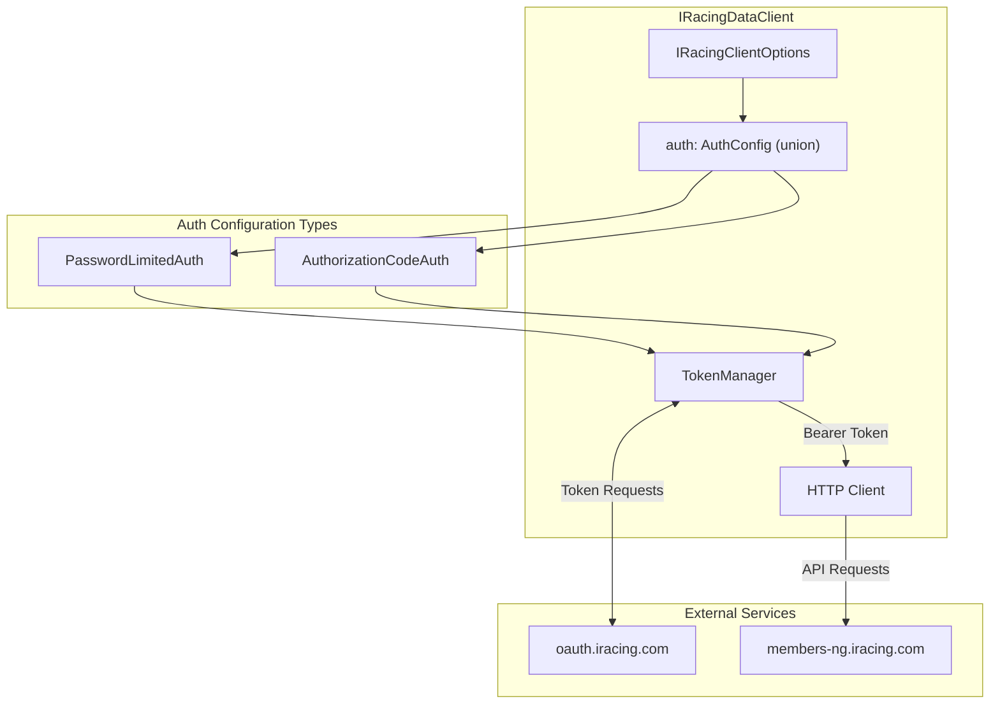
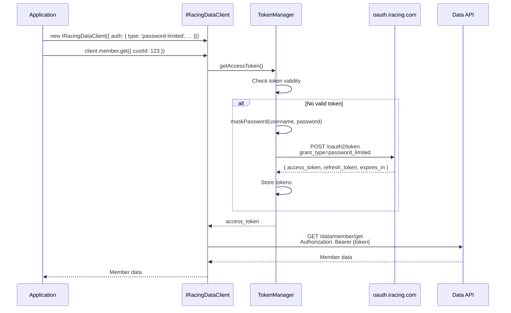
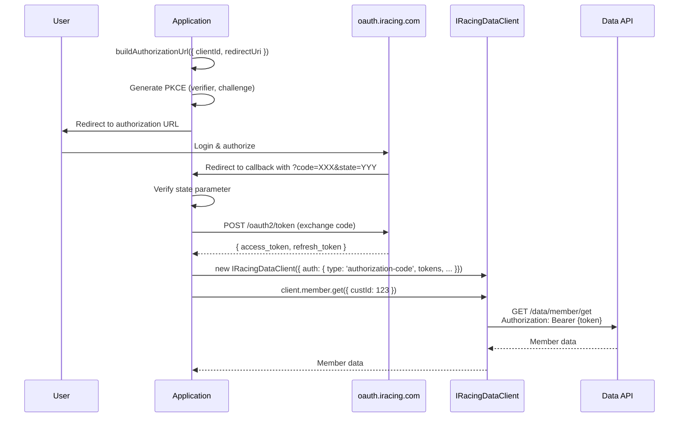
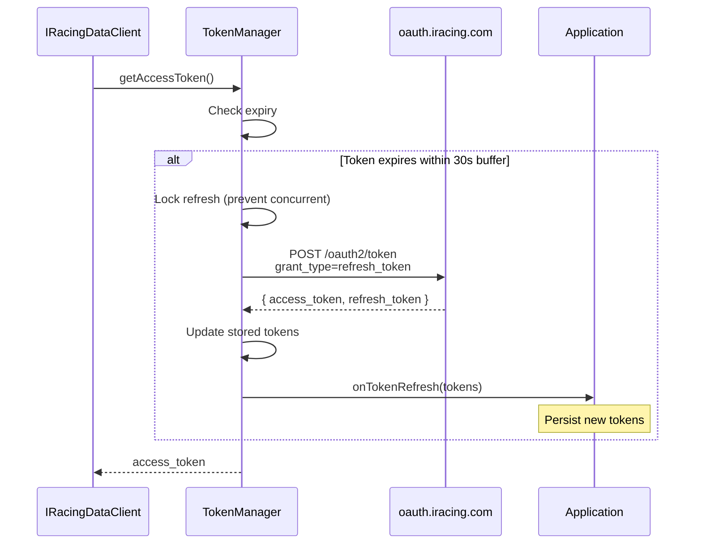
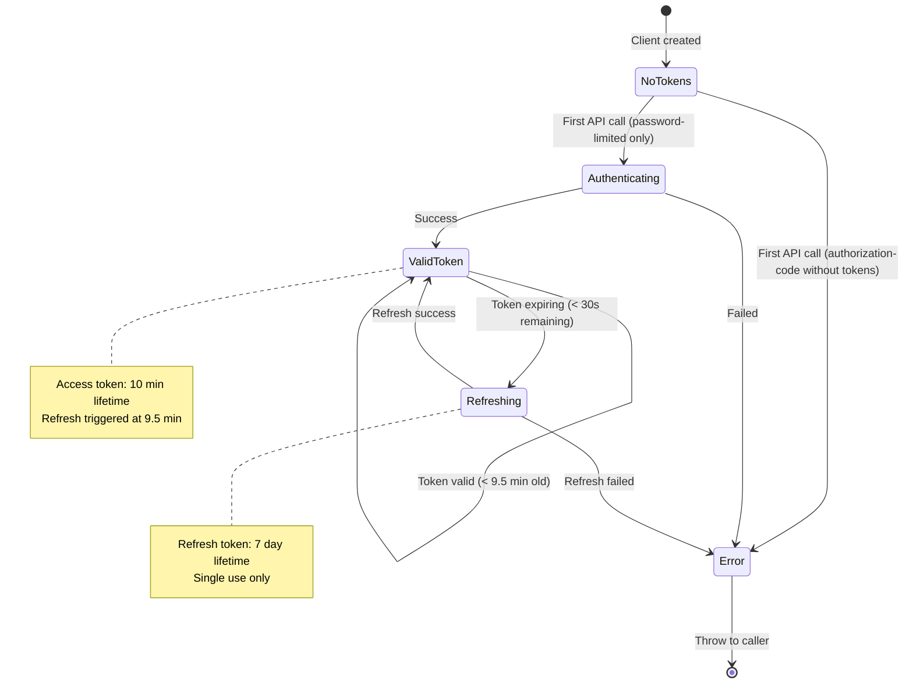
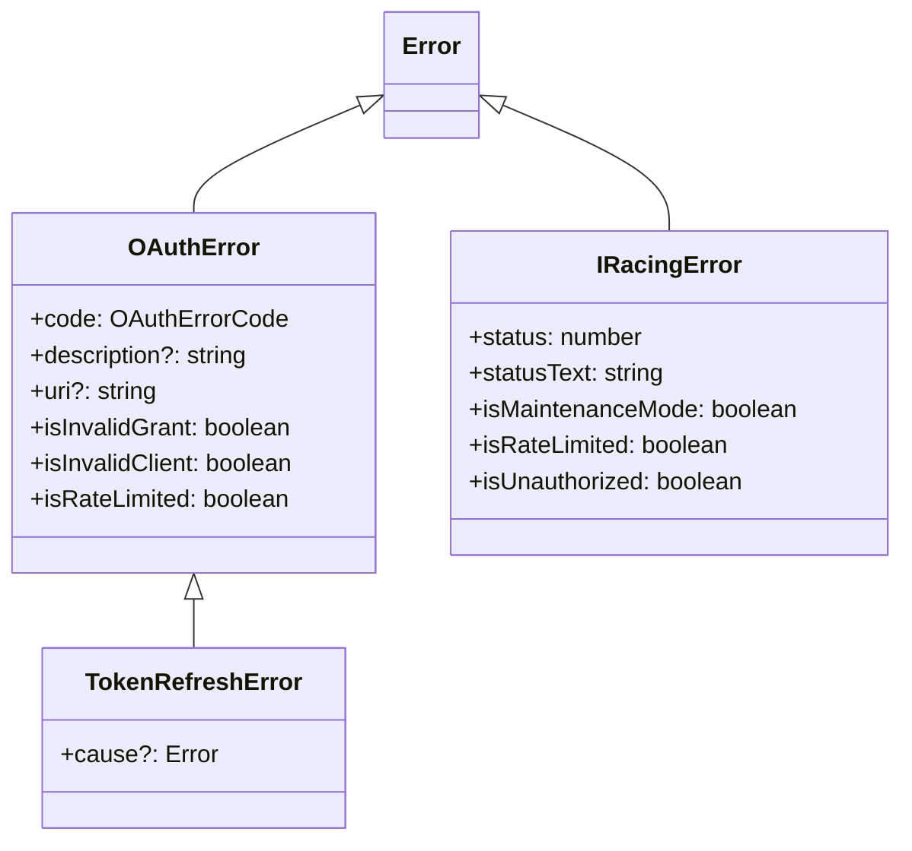

# iRacing OAuth2 Authentication Flows Implementation Plan

## Overview

This plan outlines the implementation strategy for migrating the iRacing Data Client from legacy cookie-based authentication to the official iRacing OAuth2 authentication system.

### Background

As of December 9, 2025 (2026 Season 1 Release), iRacing retired legacy read-only authentication. All third-party applications must use OAuth2 authentication. The current client implementation uses the legacy `members-ng.iracing.com/auth` endpoint which is **no longer supported**.

### References

- [iRacing OAuth2 Authentication Flows Overview](https://oauth.iracing.com/oauth2/book/authentication_flows_overview.html)
- [iRacing Token Endpoint](https://oauth.iracing.com/oauth2/book/token_endpoint.html)
- [Password Limited Flow](https://oauth.iracing.com/oauth2/book/password_limited_flow.html)
- [OAuth Client Credentials Support](https://support.iracing.com/support/solutions/articles/31000177790-oauth-client-credentials)
- [Client Registration](https://oauth.iracing.com/oauth2/book/client_registration.html)
- [Legacy Auth Retirement](https://support.iracing.com/support/solutions/articles/31000173894-enabling-or-disabling-legacy-read-only-authentication)

---

## Architecture Overview



---

## Authentication Flows

iRacing OAuth2 supports two authentication flows:

### Flow Comparison

| Feature | Password Limited | Authorization Code |
|---------|-----------------|-------------------|
| Use case | Scripts, CLIs, backends | Web apps, multi-user apps |
| Multi-user support | ❌ Owner only | ✅ Any user |
| Requires user interaction | ❌ | ✅ (login redirect) |
| 2FA bypass | ✅ | ❌ |
| Redirect URI required | ❌ | ✅ |

### 1. Password Limited Flow

**Use Case**: Scripts, CLI tools, and backend services that run unattended on behalf of the client developer only.



**Characteristics**:
- In-house extension of OAuth 2.1 (based on deprecated Resource Owner Password Credentials Grant)
- Only the registered user (client owner) can authenticate
- Bypasses two-factor authentication (2FA)
- Does not require redirect URIs
- Most common flow for data API clients like this one

**Token Lifetimes**:
- Access Token: 600 seconds (10 minutes), reusable
- Refresh Token: 7 days, single use only

**Required Credentials**:
- `client_id`: Issued by iRacing during client registration
- `client_secret`: Issued by iRacing (must be URL-encoded)
- `username`: iRacing account email (must match registered client owner)
- `password`: Must be "masked" with username before sending

### 2. Authorization Code Flow (with PKCE)

**Use Case**: Web applications and desktop apps that need to access iRacing data on behalf of other users.



**Characteristics**:
- Standard OAuth 2.1 authorization code flow
- Supports PKCE (Proof Key for Code Exchange) for enhanced security
- Requires user to authenticate via iRacing's login page
- Requires registered redirect URIs
- Appropriate for multi-user applications

### Token Refresh Flow

Both flows use the same refresh mechanism:



---

## Public API Contract

### Core Types

```typescript
// src/auth/types.ts

import * as z from 'zod/mini';

/**
 * Fetch-like function type for HTTP requests.
 * Allows injection of custom fetch implementations for testing.
 */
export type FetchLike = (input: RequestInfo | URL, init?: RequestInit) => Promise<Response>;

/**
 * Zod schema for validating OAuth token responses.
 * Provides runtime validation of iRacing's token endpoint responses.
 */
export const TokenResponseSchema = z.object({
  access_token: z.string(),
  token_type: z.literal('Bearer'),
  expires_in: z.number(),
  refresh_token: z.optional(z.string()),
  refresh_token_expires_in: z.optional(z.number()),
  scope: z.optional(z.string()),
});

/**
 * OAuth token response from iRacing's token endpoint.
 */
export type TokenResponse = z.infer<typeof TokenResponseSchema>;

/**
 * Internal token state with computed expiry.
 */
export interface TokenState {
  accessToken: string;
  refreshToken: string | null;
  expiresAt: number;  // Unix timestamp in seconds
  tokenType: 'Bearer';
}

/**
 * Callback invoked when tokens are obtained or refreshed.
 * Use this to persist tokens for reuse across sessions.
 */
export type OnTokenRefresh = (tokens: TokenResponse) => void | Promise<void>;

/**
 * PKCE code challenge and verifier pair.
 */
export interface PKCEPair {
  verifier: string;
  challenge: string;
}
```

### Authentication Configuration Union

The `auth` option accepts a discriminated union of the two OAuth flows:

```typescript
// src/auth/types.ts

/**
 * Password Limited OAuth flow configuration.
 *
 * Use for scripts, CLI tools, and backend services running on behalf of
 * the registered client developer only. This is the most common flow for
 * automated data access.
 *
 * @example
 * ```typescript
 * const client = new IRacingDataClient({
 *   auth: {
 *     type: 'password-limited',
 *     clientId: process.env.IRACING_CLIENT_ID,
 *     clientSecret: process.env.IRACING_CLIENT_SECRET,
 *     username: process.env.IRACING_USERNAME,
 *     password: process.env.IRACING_PASSWORD,
 *   },
 * });
 * ```
 */
export interface PasswordLimitedAuth {
  type: 'password-limited';

  /** OAuth client ID issued by iRacing */
  clientId: string;

  /** OAuth client secret issued by iRacing */
  clientSecret: string;

  /** iRacing account email (must match registered client owner) */
  username: string;

  /** iRacing account password */
  password: string;

  /**
   * Pre-obtained tokens to skip initial authentication.
   * Useful for reusing tokens across client instances.
   */
  tokens?: {
    accessToken: string;
    refreshToken?: string;
    expiresAt?: number;
  };

  /**
   * Called when tokens are obtained or refreshed.
   * Use to persist tokens for reuse across sessions.
   */
  onTokenRefresh?: OnTokenRefresh;
}

/**
 * Authorization Code OAuth flow configuration.
 *
 * Use for web/desktop applications that need to access iRacing data
 * on behalf of other users. Requires completing the OAuth flow externally
 * before creating the client.
 *
 * @example
 * ```typescript
 * // After completing OAuth flow and obtaining tokens:
 * const client = new IRacingDataClient({
 *   auth: {
 *     type: 'authorization-code',
 *     clientId: process.env.IRACING_CLIENT_ID,
 *     clientSecret: process.env.IRACING_CLIENT_SECRET,
 *     tokens: {
 *       accessToken: savedTokens.access_token,
 *       refreshToken: savedTokens.refresh_token,
 *       expiresAt: savedTokens.expires_at,
 *     },
 *   },
 * });
 * ```
 */
export interface AuthorizationCodeAuth {
  type: 'authorization-code';

  /** OAuth client ID issued by iRacing */
  clientId: string;

  /** OAuth client secret issued by iRacing */
  clientSecret: string;

  /**
   * Tokens obtained from completing the Authorization Code flow.
   * Required since this flow requires user interaction.
   */
  tokens: {
    accessToken: string;
    refreshToken?: string;
    expiresAt?: number;
  };

  /**
   * Called when tokens are refreshed.
   * Use to persist new tokens for the user's session.
   */
  onTokenRefresh?: OnTokenRefresh;
}

/**
 * Discriminated union of supported authentication strategies.
 */
export type AuthConfig = PasswordLimitedAuth | AuthorizationCodeAuth;
```

### Client Options

```typescript
// src/client.ts

/**
 * Configuration options for the iRacing Data Client.
 */
export interface IRacingClientOptions {
  /**
   * Authentication configuration.
   * Choose between Password Limited (for scripts) or Authorization Code (for web apps).
   */
  auth: AuthConfig;

  /**
   * Custom fetch implementation.
   * Useful for testing or environments without global fetch.
   * @default globalThis.fetch
   */
  fetchFn?: FetchLike;

  /**
   * Enable runtime validation of request parameters against Zod schemas.
   * @default true
   */
  validateParams?: boolean;
}
```

### Type Guards

```typescript
// src/auth/types.ts

export function isPasswordLimitedAuth(auth: AuthConfig): auth is PasswordLimitedAuth {
  return auth.type === 'password-limited';
}

export function isAuthorizationCodeAuth(auth: AuthConfig): auth is AuthorizationCodeAuth {
  return auth.type === 'authorization-code';
}
```

### Authorization Code Flow Helpers

Standalone functions to help complete the Authorization Code flow:

```typescript
// src/auth/index.ts (exported from package)

/**
 * Builds the authorization URL to redirect users to for OAuth login.
 */
export async function buildAuthorizationUrl(options: {
  clientId: string;
  redirectUri: string;
  state?: string;
  usePKCE?: boolean;
}): Promise<{
  url: string;
  state: string;
  pkce?: PKCEPair;
}>;

/**
 * Exchanges an authorization code for tokens.
 * Call this in your redirect handler after the user authorizes.
 */
export async function exchangeAuthorizationCode(options: {
  clientId: string;
  clientSecret: string;
  code: string;
  redirectUri: string;
  codeVerifier?: string;
}): Promise<TokenResponse>;
```

---

## Detailed Implementation

### File Structure

```
src/
├── auth/
│   ├── index.ts                    # Public exports
│   ├── types.ts                    # Type definitions (AuthConfig union)
│   ├── errors.ts                   # OAuthError class
│   ├── crypto.ts                   # Password masking, PKCE generation
│   ├── token-manager.ts            # Token storage and refresh logic
│   ├── flows/
│   │   ├── password-limited.ts     # Password Limited flow
│   │   ├── authorization-code.ts   # Auth Code flow helpers
│   │   └── refresh.ts              # Refresh token flow
│   └── constants.ts                # OAuth endpoints, timing constants
├── client.ts                       # Updated IRacingClient
└── index.ts                        # Updated exports
```

### Package Exports

```typescript
// src/auth/index.ts - Auth module public exports

export type {
  AuthConfig,
  PasswordLimitedAuth,
  AuthorizationCodeAuth,
  TokenResponse,
  TokenState,
  OnTokenRefresh,
  PKCEPair,
  FetchLike,
} from './types';

export { TokenResponseSchema } from './types';

export {
  isPasswordLimitedAuth,
  isAuthorizationCodeAuth,
} from './types';

export {
  OAuthError,
  TokenRefreshError,
  type OAuthErrorCode,
} from './errors';

export {
  buildAuthorizationUrl,
  exchangeAuthorizationCode,
} from './flows/authorization-code';
```

```typescript
// src/index.ts - Main package exports

// Re-export client
export { IRacingClient, type IRacingClientOptions } from './client';
export { IRacingError } from './client';

// Re-export auth types and helpers
export type {
  AuthConfig,
  PasswordLimitedAuth,
  AuthorizationCodeAuth,
  TokenResponse,
  OnTokenRefresh,
} from './auth';

export {
  OAuthError,
  TokenRefreshError,
  buildAuthorizationUrl,
  exchangeAuthorizationCode,
} from './auth';

// Re-export service types (existing)
export * from './member';
export * from './results';
// ... other services
```

### Constants

```typescript
// src/auth/constants.ts

export const OAUTH_ENDPOINTS = {
  authorize: 'https://oauth.iracing.com/oauth2/authorize',
  token: 'https://oauth.iracing.com/oauth2/token',
} as const;

/** Required scope for iRacing Data API access */
export const IRACING_AUTH_SCOPE = 'iracing.auth';

export const DATA_API_BASE_URL = 'https://members-ng.iracing.com';

/** Buffer time (seconds) before token expiry to trigger refresh */
export const TOKEN_REFRESH_BUFFER_SECONDS = 30;

/** Default access token lifetime (10 minutes) */
export const DEFAULT_ACCESS_TOKEN_LIFETIME_SECONDS = 600;

/** Minimum interval between token requests to avoid rate limiting */
export const MIN_TOKEN_REQUEST_INTERVAL_MS = 1000;
```

### Cryptographic Utilities

```typescript
// src/auth/crypto.ts

import type { PKCEPair } from './types';

/**
 * Masks a secret using iRacing's masking algorithm.
 *
 * Both password and client_secret must be masked before transmission.
 * - For password: identifier is the username (email)
 * - For client_secret: identifier is the client_id
 *
 * Algorithm: Base64(SHA256(secret + normalize(identifier)))
 * where normalize = trim + lowercase
 *
 * @param secret - The secret to mask (password or client_secret)
 * @param identifier - The identifier to use (username or client_id)
 * @returns Base64-encoded SHA-256 hash
 *
 * @see https://oauth.iracing.com/oauth2/book/token_endpoint.html
 */
export async function maskSecret(secret: string, identifier: string): Promise<string> {
  const normalizedId = identifier.trim().toLowerCase();
  const combined = secret + normalizedId;

  const encoder = new TextEncoder();
  const data = encoder.encode(combined);
  const hashBuffer = await crypto.subtle.digest('SHA-256', data);
  const hashArray = Array.from(new Uint8Array(hashBuffer));

  // Standard Base64 encoding (NOT URL-safe variant)
  return btoa(String.fromCharCode(...hashArray));
}

/**
 * Masks the password with the username.
 * Convenience wrapper around maskSecret.
 */
export async function maskPassword(username: string, password: string): Promise<string> {
  return maskSecret(password, username);
}

/**
 * Masks the client secret with the client ID.
 * Convenience wrapper around maskSecret.
 */
export async function maskClientSecret(clientId: string, clientSecret: string): Promise<string> {
  return maskSecret(clientSecret, clientId);
}

/**
 * Generates a cryptographically secure random string for PKCE verifier.
 * Uses unreserved URI characters per RFC 7636.
 *
 * @param length - Length of the string (43-128 per RFC 7636, default 64)
 */
export function generateRandomString(length: number = 64): string {
  const unreservedChars = 'ABCDEFGHIJKLMNOPQRSTUVWXYZabcdefghijklmnopqrstuvwxyz0123456789-._~';
  const randomValues = new Uint8Array(length);
  crypto.getRandomValues(randomValues);
  return Array.from(randomValues, (byte) => unreservedChars[byte % unreservedChars.length]).join('');
}

/**
 * Generates a PKCE code verifier and challenge pair.
 * The challenge is the Base64URL-encoded SHA-256 hash of the verifier.
 */
export async function generatePKCE(): Promise<PKCEPair> {
  const verifier = generateRandomString(64);

  const encoder = new TextEncoder();
  const data = encoder.encode(verifier);
  const hashBuffer = await crypto.subtle.digest('SHA-256', data);
  const hashArray = Array.from(new Uint8Array(hashBuffer));

  // Base64URL encoding (no padding, URL-safe characters)
  const challenge = btoa(String.fromCharCode(...hashArray))
    .replace(/\+/g, '-')
    .replace(/\//g, '_')
    .replace(/=/g, '');

  return { verifier, challenge };
}
```

### Error Classes

> **Note**: `OAuthError` and `TokenRefreshError` are new classes in `src/auth/errors.ts`.
> `IRacingError` remains in `src/client.ts` for API-level errors (rate limiting, maintenance, etc.).

```typescript
// src/auth/errors.ts

/**
 * OAuth error codes returned by iRacing's OAuth server.
 */
export type OAuthErrorCode =
  | 'invalid_request'
  | 'invalid_client'
  | 'invalid_grant'
  | 'unauthorized_client'
  | 'unsupported_grant_type'
  | 'invalid_scope'
  | 'rate_limited'
  | 'server_error';

/**
 * Error thrown for OAuth-related failures.
 */
export class OAuthError extends Error {
  public readonly name = 'OAuthError';

  constructor(
    public readonly code: OAuthErrorCode | string,
    public readonly description?: string,
    public readonly uri?: string
  ) {
    super(description || code);
  }

  get isInvalidGrant(): boolean {
    return this.code === 'invalid_grant';
  }

  get isInvalidClient(): boolean {
    return this.code === 'invalid_client';
  }

  get isRateLimited(): boolean {
    return this.code === 'rate_limited';
  }

  get isUnauthorizedClient(): boolean {
    return this.code === 'unauthorized_client';
  }
}

/**
 * Error thrown when token refresh fails and no recovery is possible.
 */
export class TokenRefreshError extends OAuthError {
  public readonly name = 'TokenRefreshError';

  constructor(
    code: OAuthErrorCode | string,
    description?: string,
    public readonly cause?: Error
  ) {
    super(code, description);
  }
}
```

### Token Manager

```typescript
// src/auth/token-manager.ts

import {
  TOKEN_REFRESH_BUFFER_SECONDS,
  DEFAULT_ACCESS_TOKEN_LIFETIME_SECONDS,
  MIN_TOKEN_REQUEST_INTERVAL_MS,
} from './constants';
import { OAuthError, TokenRefreshError } from './errors';
import { refreshTokens } from './flows/refresh';
import type { TokenState, TokenResponse, OnTokenRefresh, FetchLike } from './types';
import { TokenResponseSchema } from './types';

export interface TokenManagerOptions {
  clientId: string;
  clientSecret: string;
  fetchFn: FetchLike;
  onTokenRefresh?: OnTokenRefresh;
}

/**
 * Manages OAuth token lifecycle including storage, validation, and refresh.
 *
 * Features:
 * - Automatic token refresh before expiry
 * - Concurrent refresh request deduplication
 * - Rate limiting protection
 * - Token persistence callbacks
 */
export class TokenManager {
  private tokenState: TokenState | null = null;
  private refreshPromise: Promise<TokenState> | null = null;
  private lastTokenRequest: number = 0;

  private readonly clientId: string;
  private readonly clientSecret: string;
  private readonly fetchFn: FetchLike;
  private readonly onTokenRefresh?: OnTokenRefresh;

  constructor(options: TokenManagerOptions) {
    this.clientId = options.clientId;
    this.clientSecret = options.clientSecret;
    this.fetchFn = options.fetchFn;
    this.onTokenRefresh = options.onTokenRefresh;
  }

  /** Sets token state from a token response */
  setTokens(response: TokenResponse): void {
    const now = Math.floor(Date.now() / 1000);
    this.tokenState = {
      accessToken: response.access_token,
      refreshToken: response.refresh_token ?? null,
      expiresAt: now + (response.expires_in || DEFAULT_ACCESS_TOKEN_LIFETIME_SECONDS),
      tokenType: response.token_type,
    };
  }

  /** Sets token state from pre-obtained tokens */
  setTokenState(state: TokenState): void {
    this.tokenState = state;
  }

  /** Returns true if we have tokens (valid or expired) */
  hasTokens(): boolean {
    return this.tokenState !== null;
  }

  /** Returns true if the current access token is valid and not expiring soon */
  isTokenValid(): boolean {
    if (!this.tokenState) return false;
    const now = Math.floor(Date.now() / 1000);
    return this.tokenState.expiresAt > now + TOKEN_REFRESH_BUFFER_SECONDS;
  }

  /** Returns true if we can refresh tokens */
  canRefresh(): boolean {
    return this.tokenState?.refreshToken !== null;
  }

  /**
   * Gets a valid access token, refreshing if necessary.
   * Handles concurrent requests and rate limiting.
   */
  async getAccessToken(): Promise<string> {
    if (this.isTokenValid()) {
      return this.tokenState!.accessToken;
    }

    if (!this.tokenState) {
      throw new OAuthError('invalid_grant', 'No tokens available. Please authenticate first.');
    }

    if (!this.canRefresh()) {
      throw new TokenRefreshError(
        'invalid_grant',
        'Access token expired and no refresh token available.'
      );
    }

    // Deduplicate concurrent refresh requests
    if (!this.refreshPromise) {
      this.refreshPromise = this.executeRefresh();
    }

    try {
      const newState = await this.refreshPromise;
      return newState.accessToken;
    } finally {
      this.refreshPromise = null;
    }
  }

  /** Clears all stored tokens */
  clearTokens(): void {
    this.tokenState = null;
  }

  private async executeRefresh(): Promise<TokenState> {
    // Rate limiting
    const now = Date.now();
    const timeSinceLastRequest = now - this.lastTokenRequest;
    if (timeSinceLastRequest < MIN_TOKEN_REQUEST_INTERVAL_MS) {
      await this.sleep(MIN_TOKEN_REQUEST_INTERVAL_MS - timeSinceLastRequest);
    }
    this.lastTokenRequest = Date.now();

    try {
      const response = await refreshTokens({
        clientId: this.clientId,
        clientSecret: this.clientSecret,
        refreshToken: this.tokenState!.refreshToken!,
        fetchFn: this.fetchFn,
      });

      this.setTokens(response);

      if (this.onTokenRefresh) {
        await Promise.resolve(this.onTokenRefresh(response));
      }

      return this.tokenState!;
    } catch (error) {
      if (error instanceof OAuthError) {
        throw new TokenRefreshError(error.code, error.description, error);
      }
      throw error;
    }
  }

  private sleep(ms: number): Promise<void> {
    return new Promise((resolve) => setTimeout(resolve, ms));
  }
}
```

### Password Limited Flow

```typescript
// src/auth/flows/password-limited.ts

import { OAUTH_ENDPOINTS } from '../constants';
import { maskPassword, maskClientSecret } from '../crypto';
import { OAuthError } from '../errors';
import type { TokenResponse, FetchLike } from '../types';
import { TokenResponseSchema } from '../types';

export interface PasswordLimitedTokenRequest {
  clientId: string;
  clientSecret: string;
  username: string;
  password: string;
  fetchFn: FetchLike;
}

/**
 * Requests an access token using the Password Limited grant.
 *
 * Both the password and client_secret are masked before transmission:
 * - password: masked with username as identifier
 * - client_secret: masked with client_id as identifier
 */
export async function requestPasswordLimitedToken(
  options: PasswordLimitedTokenRequest
): Promise<TokenResponse> {
  const { clientId, clientSecret, username, password, fetchFn } = options;

  // Both password and client_secret must be masked
  const [maskedPassword, maskedClientSecret] = await Promise.all([
    maskPassword(username, password),
    maskClientSecret(clientId, clientSecret),
  ]);

  const body = new URLSearchParams({
    grant_type: 'password_limited',
    client_id: clientId,
    client_secret: maskedClientSecret,
    username: username,
    password: maskedPassword,
    scope: 'iracing.auth',
  });

  const response = await fetchFn(OAUTH_ENDPOINTS.token, {
    method: 'POST',
    headers: { 'Content-Type': 'application/x-www-form-urlencoded' },
    body: body.toString(),
  });

  const data = await response.json();

  if (!response.ok) {
    throw new OAuthError(data.error, data.error_description, data.error_uri);
  }

  // Validate response structure
  return TokenResponseSchema.parse(data);
}
```

### Authorization Code Flow

```typescript
// src/auth/flows/authorization-code.ts

import { OAUTH_ENDPOINTS } from '../constants';
import { generatePKCE, maskClientSecret } from '../crypto';
import { OAuthError } from '../errors';
import type { TokenResponse, PKCEPair, FetchLike } from '../types';
import { TokenResponseSchema } from '../types';

export interface AuthorizationUrlOptions {
  clientId: string;
  redirectUri: string;
  scope?: string;
  state?: string;
  usePKCE?: boolean;
}

export interface AuthorizationUrlResult {
  url: string;
  state: string;
  pkce?: PKCEPair;
}

/**
 * Builds the authorization URL for the Authorization Code flow.
 */
export async function buildAuthorizationUrl(
  options: AuthorizationUrlOptions
): Promise<AuthorizationUrlResult> {
  const { clientId, redirectUri, scope, usePKCE = true } = options;
  const state = options.state ?? crypto.randomUUID();

  const params = new URLSearchParams({
    response_type: 'code',
    client_id: clientId,
    redirect_uri: redirectUri,
    state: state,
  });

  if (scope) {
    params.set('scope', scope);
  }

  let pkce: PKCEPair | undefined;
  if (usePKCE) {
    pkce = await generatePKCE();
    params.set('code_challenge', pkce.challenge);
    params.set('code_challenge_method', 'S256');
  }

  return {
    url: `${OAUTH_ENDPOINTS.authorize}?${params.toString()}`,
    state,
    pkce,
  };
}

export interface CodeExchangeOptions {
  clientId: string;
  clientSecret: string;
  code: string;
  redirectUri: string;
  codeVerifier?: string;
  fetchFn?: FetchLike;
}

/**
 * Exchanges an authorization code for tokens.
 * The client_secret is masked with the client_id before transmission.
 */
export async function exchangeAuthorizationCode(
  options: CodeExchangeOptions
): Promise<TokenResponse> {
  const { clientId, clientSecret, code, redirectUri, codeVerifier } = options;
  const fetchFn = options.fetchFn ?? globalThis.fetch;

  const maskedSecret = await maskClientSecret(clientId, clientSecret);

  const body = new URLSearchParams({
    grant_type: 'authorization_code',
    client_id: clientId,
    client_secret: maskedSecret,
    code: code,
    redirect_uri: redirectUri,
  });

  if (codeVerifier) {
    body.set('code_verifier', codeVerifier);
  }

  const response = await fetchFn(OAUTH_ENDPOINTS.token, {
    method: 'POST',
    headers: { 'Content-Type': 'application/x-www-form-urlencoded' },
    body: body.toString(),
  });

  const data = await response.json();

  if (!response.ok) {
    throw new OAuthError(data.error, data.error_description, data.error_uri);
  }

  // Validate response structure
  return TokenResponseSchema.parse(data);
}
```

### Refresh Token Flow

```typescript
// src/auth/flows/refresh.ts

import { OAUTH_ENDPOINTS } from '../constants';
import { maskClientSecret } from '../crypto';
import { OAuthError } from '../errors';
import type { TokenResponse, FetchLike } from '../types';
import { TokenResponseSchema } from '../types';

export interface RefreshTokenRequest {
  clientId: string;
  clientSecret: string;
  refreshToken: string;
  fetchFn: FetchLike;
}

/**
 * Exchanges a refresh token for new tokens.
 * Note: Refresh tokens are single-use.
 * The client_secret is masked with the client_id before transmission.
 */
export async function refreshTokens(options: RefreshTokenRequest): Promise<TokenResponse> {
  const { clientId, clientSecret, refreshToken, fetchFn } = options;

  const maskedSecret = await maskClientSecret(clientId, clientSecret);

  const body = new URLSearchParams({
    grant_type: 'refresh_token',
    client_id: clientId,
    client_secret: maskedSecret,
    refresh_token: refreshToken,
    scope: 'iracing.auth',
  });

  const response = await fetchFn(OAUTH_ENDPOINTS.token, {
    method: 'POST',
    headers: { 'Content-Type': 'application/x-www-form-urlencoded' },
    body: body.toString(),
  });

  const data = await response.json();

  if (!response.ok) {
    throw new OAuthError(data.error, data.error_description, data.error_uri);
  }

  // Validate response structure
  return TokenResponseSchema.parse(data);
}
```

### Updated IRacingClient

```typescript
// src/client.ts

import {
  AuthConfig,
  isPasswordLimitedAuth,
  isAuthorizationCodeAuth,
  TokenState,
} from './auth/types';
import { TokenManager } from './auth/token-manager';
import { requestPasswordLimitedToken } from './auth/flows/password-limited';
import { OAuthError } from './auth/errors';
import { DATA_API_BASE_URL, DEFAULT_ACCESS_TOKEN_LIFETIME_SECONDS } from './auth/constants';

export type FetchLike = (input: RequestInfo | URL, init?: RequestInit) => Promise<Response>;

export interface IRacingClientOptions {
  auth: AuthConfig;
  fetchFn?: FetchLike;
  validateParams?: boolean;
}

export class IRacingClient {
  private readonly fetchFn: FetchLike;
  private readonly authConfig: AuthConfig;
  private readonly tokenManager: TokenManager;
  private readonly validateParams: boolean;

  private authenticationPromise: Promise<void> | null = null;

  constructor(options: IRacingClientOptions) {
    this.fetchFn = options.fetchFn ?? globalThis.fetch.bind(globalThis);
    this.authConfig = options.auth;
    this.validateParams = options.validateParams ?? true;

    // Initialize token manager
    this.tokenManager = new TokenManager({
      clientId: options.auth.clientId,
      clientSecret: options.auth.clientSecret,
      fetchFn: this.fetchFn,
      onTokenRefresh: options.auth.onTokenRefresh,
    });

    // Initialize with pre-obtained tokens if provided
    const tokens = isPasswordLimitedAuth(options.auth)
      ? options.auth.tokens
      : options.auth.tokens;

    if (tokens) {
      this.tokenManager.setTokenState({
        accessToken: tokens.accessToken,
        refreshToken: tokens.refreshToken ?? null,
        expiresAt: tokens.expiresAt ?? Math.floor(Date.now() / 1000) + DEFAULT_ACCESS_TOKEN_LIFETIME_SECONDS,
        tokenType: 'Bearer',
      });
    }
  }

  /**
   * Ensures the client is authenticated before making API requests.
   */
  private async ensureAuthenticated(): Promise<void> {
    // Already have tokens
    if (this.tokenManager.hasTokens()) {
      return;
    }

    // Authorization Code flow requires pre-obtained tokens
    if (isAuthorizationCodeAuth(this.authConfig)) {
      throw new OAuthError(
        'invalid_grant',
        'Authorization Code flow requires tokens. Use buildAuthorizationUrl() and ' +
        'exchangeAuthorizationCode() to obtain tokens first.'
      );
    }

    // Password Limited flow - authenticate
    if (isPasswordLimitedAuth(this.authConfig)) {
      // Prevent concurrent authentication
      if (!this.authenticationPromise) {
        this.authenticationPromise = this.authenticatePasswordLimited();
      }

      try {
        await this.authenticationPromise;
      } finally {
        this.authenticationPromise = null;
      }
    }
  }

  private async authenticatePasswordLimited(): Promise<void> {
    if (!isPasswordLimitedAuth(this.authConfig)) {
      throw new Error('Invalid auth config');
    }

    const tokens = await requestPasswordLimitedToken({
      clientId: this.authConfig.clientId,
      clientSecret: this.authConfig.clientSecret,
      username: this.authConfig.username,
      password: this.authConfig.password,
      fetchFn: this.fetchFn,
    });

    this.tokenManager.setTokens(tokens);

    if (this.authConfig.onTokenRefresh) {
      await Promise.resolve(this.authConfig.onTokenRefresh(tokens));
    }
  }

  /**
   * Gets authorization headers for API requests.
   */
  private async getAuthHeaders(): Promise<Record<string, string>> {
    const accessToken = await this.tokenManager.getAccessToken();
    return { 'Authorization': `Bearer ${accessToken}` };
  }

  /**
   * Makes a GET request to the iRacing Data API.
   */
  async get<T = unknown>(
    url: string,
    options?: { params?: Record<string, unknown>; schema?: z.ZodMiniType<T> }
  ): Promise<T> {
    await this.ensureAuthenticated();

    const fullUrl = this.buildUrl(url, options?.params);
    const headers = await this.getAuthHeaders();

    const response = await this.fetchFn(fullUrl, { headers });

    if (!response.ok) {
      await this.handleErrorResponse(response);
    }

    return this.handleSuccessResponse<T>(response, options?.schema);
  }

  // ... existing methods (buildUrl, handleErrorResponse, handleSuccessResponse, etc.)
}
```

---

## Usage Examples

### Password Limited Flow (Most Common)

```typescript
import { IRacingDataClient } from 'iracing-data-client';

// Basic usage - authenticates on first API call
const client = new IRacingDataClient({
  auth: {
    type: 'password-limited',
    clientId: process.env.IRACING_CLIENT_ID!,
    clientSecret: process.env.IRACING_CLIENT_SECRET!,
    username: process.env.IRACING_USERNAME!,
    password: process.env.IRACING_PASSWORD!,
  },
});

const member = await client.member.get({ custId: 123456 });

// With token persistence
const client = new IRacingDataClient({
  auth: {
    type: 'password-limited',
    clientId: process.env.IRACING_CLIENT_ID!,
    clientSecret: process.env.IRACING_CLIENT_SECRET!,
    username: process.env.IRACING_USERNAME!,
    password: process.env.IRACING_PASSWORD!,
    onTokenRefresh: async (tokens) => {
      await fs.writeFile('tokens.json', JSON.stringify(tokens));
    },
  },
});

// Reusing saved tokens
const savedTokens = JSON.parse(await fs.readFile('tokens.json', 'utf-8'));
const client = new IRacingDataClient({
  auth: {
    type: 'password-limited',
    clientId: process.env.IRACING_CLIENT_ID!,
    clientSecret: process.env.IRACING_CLIENT_SECRET!,
    username: process.env.IRACING_USERNAME!,
    password: process.env.IRACING_PASSWORD!,
    tokens: {
      accessToken: savedTokens.access_token,
      refreshToken: savedTokens.refresh_token,
    },
    onTokenRefresh: async (tokens) => {
      await fs.writeFile('tokens.json', JSON.stringify(tokens));
    },
  },
});
```

### Authorization Code Flow (Web Applications)

```typescript
import {
  IRacingDataClient,
  buildAuthorizationUrl,
  exchangeAuthorizationCode,
} from 'iracing-data-client';

// Step 1: Build authorization URL and redirect user
app.get('/login', async (req, res) => {
  const { url, state, pkce } = await buildAuthorizationUrl({
    clientId: process.env.IRACING_CLIENT_ID!,
    redirectUri: 'https://myapp.com/callback',
    usePKCE: true,
  });

  // Store in session for callback verification
  req.session.oauthState = state;
  req.session.pkceVerifier = pkce?.verifier;

  res.redirect(url);
});

// Step 2: Handle callback
app.get('/callback', async (req, res) => {
  const { code, state } = req.query;

  if (state !== req.session.oauthState) {
    return res.status(400).send('Invalid state');
  }

  const tokens = await exchangeAuthorizationCode({
    clientId: process.env.IRACING_CLIENT_ID!,
    clientSecret: process.env.IRACING_CLIENT_SECRET!,
    code: code as string,
    redirectUri: 'https://myapp.com/callback',
    codeVerifier: req.session.pkceVerifier,
  });

  req.session.tokens = tokens;
  res.redirect('/dashboard');
});

// Step 3: Use the client
app.get('/dashboard', async (req, res) => {
  const client = new IRacingDataClient({
    auth: {
      type: 'authorization-code',
      clientId: process.env.IRACING_CLIENT_ID!,
      clientSecret: process.env.IRACING_CLIENT_SECRET!,
      tokens: {
        accessToken: req.session.tokens.access_token,
        refreshToken: req.session.tokens.refresh_token,
      },
      onTokenRefresh: (tokens) => {
        req.session.tokens = tokens;
      },
    },
  });

  const member = await client.member.get({ custId: req.session.userId });
  res.json(member);
});
```

---

## Token Lifecycle



---

## Error Handling



### Error Recovery

```typescript
import { IRacingDataClient, OAuthError, TokenRefreshError } from 'iracing-data-client';

try {
  const member = await client.member.get({ custId: 123 });
} catch (error) {
  if (error instanceof TokenRefreshError) {
    // Refresh token expired - user needs to re-authenticate
    console.error('Session expired. Please log in again.');
  } else if (error instanceof OAuthError) {
    if (error.isInvalidClient) {
      console.error('Invalid client credentials');
    } else if (error.isRateLimited) {
      // Back off and retry
      await sleep(5000);
    }
  }
}
```

---

## Unit Test Samples

### Crypto Utilities Tests

```typescript
// src/auth/crypto.test.ts

import { describe, it, expect } from 'vitest';
import { maskSecret, maskPassword, maskClientSecret, generatePKCE } from './crypto';

describe('maskSecret', () => {
  it('should produce consistent hash for same inputs', async () => {
    const result1 = await maskSecret('password123', 'user@example.com');
    const result2 = await maskSecret('password123', 'user@example.com');
    expect(result1).toBe(result2);
  });

  it('should normalize identifier to lowercase', async () => {
    const result1 = await maskSecret('password123', 'User@Example.com');
    const result2 = await maskSecret('password123', 'user@example.com');
    expect(result1).toBe(result2);
  });

  it('should trim whitespace from identifier', async () => {
    const result1 = await maskSecret('password123', '  user@example.com  ');
    const result2 = await maskSecret('password123', 'user@example.com');
    expect(result1).toBe(result2);
  });

  it('should produce base64 encoded output', async () => {
    const result = await maskSecret('password', 'user');
    // Base64 uses A-Z, a-z, 0-9, +, /, and = for padding
    expect(result).toMatch(/^[A-Za-z0-9+/]+=*$/);
  });
});

describe('maskPassword', () => {
  it('should mask password with username', async () => {
    const result = await maskPassword('user@example.com', 'mypassword');
    expect(result).toBeTruthy();
    expect(typeof result).toBe('string');
  });
});

describe('maskClientSecret', () => {
  it('should mask client secret with client id', async () => {
    const result = await maskClientSecret('my-client-id', 'my-client-secret');
    expect(result).toBeTruthy();
    expect(typeof result).toBe('string');
  });
});

describe('generatePKCE', () => {
  it('should generate verifier and challenge', async () => {
    const pkce = await generatePKCE();
    expect(pkce.verifier).toBeTruthy();
    expect(pkce.challenge).toBeTruthy();
    expect(pkce.verifier.length).toBe(64);
  });

  it('should use URL-safe base64 for challenge', async () => {
    const pkce = await generatePKCE();
    // URL-safe base64 uses - and _ instead of + and /, no padding
    expect(pkce.challenge).not.toMatch(/[+/=]/);
  });

  it('should generate unique values each time', async () => {
    const pkce1 = await generatePKCE();
    const pkce2 = await generatePKCE();
    expect(pkce1.verifier).not.toBe(pkce2.verifier);
  });
});
```

### OAuth Flow Tests

```typescript
// src/auth/flows/password-limited.test.ts

import { describe, it, expect, vi, beforeEach } from 'vitest';
import { requestPasswordLimitedToken } from './password-limited';
import { OAuthError } from '../errors';

describe('requestPasswordLimitedToken', () => {
  const mockFetch = vi.fn();

  beforeEach(() => {
    vi.clearAllMocks();
  });

  it('should request token with masked credentials', async () => {
    mockFetch.mockResolvedValueOnce({
      ok: true,
      json: async () => ({
        access_token: 'test-access-token',
        token_type: 'Bearer',
        expires_in: 600,
        refresh_token: 'test-refresh-token',
      }),
    });

    const result = await requestPasswordLimitedToken({
      clientId: 'test-client-id',
      clientSecret: 'test-client-secret',
      username: 'user@example.com',
      password: 'password123',
      fetchFn: mockFetch,
    });

    expect(result.access_token).toBe('test-access-token');
    expect(result.token_type).toBe('Bearer');
    expect(result.expires_in).toBe(600);

    // Verify fetch was called with correct endpoint
    expect(mockFetch).toHaveBeenCalledWith(
      'https://oauth.iracing.com/oauth2/token',
      expect.objectContaining({
        method: 'POST',
        headers: { 'Content-Type': 'application/x-www-form-urlencoded' },
      })
    );

    // Verify body contains masked credentials (not raw)
    const callArgs = mockFetch.mock.calls[0];
    const body = callArgs[1].body;
    expect(body).toContain('grant_type=password_limited');
    expect(body).toContain('client_id=test-client-id');
    expect(body).not.toContain('password=password123'); // Should be masked
    expect(body).not.toContain('client_secret=test-client-secret'); // Should be masked
  });

  it('should throw OAuthError on failure', async () => {
    mockFetch.mockResolvedValueOnce({
      ok: false,
      json: async () => ({
        error: 'invalid_grant',
        error_description: 'Invalid credentials',
      }),
    });

    await expect(
      requestPasswordLimitedToken({
        clientId: 'test-client-id',
        clientSecret: 'test-client-secret',
        username: 'user@example.com',
        password: 'wrong-password',
        fetchFn: mockFetch,
      })
    ).rejects.toThrow(OAuthError);
  });
});
```

### Token Manager Tests

```typescript
// src/auth/token-manager.test.ts

import { describe, it, expect, vi, beforeEach } from 'vitest';
import { TokenManager } from './token-manager';

describe('TokenManager', () => {
  const mockFetch = vi.fn();

  beforeEach(() => {
    vi.clearAllMocks();
    vi.useFakeTimers();
  });

  it('should return valid token without refresh', async () => {
    const manager = new TokenManager({
      clientId: 'test-client-id',
      clientSecret: 'test-client-secret',
      fetchFn: mockFetch,
    });

    const futureExpiry = Math.floor(Date.now() / 1000) + 300; // 5 min from now
    manager.setTokenState({
      accessToken: 'valid-token',
      refreshToken: 'refresh-token',
      expiresAt: futureExpiry,
      tokenType: 'Bearer',
    });

    const token = await manager.getAccessToken();
    expect(token).toBe('valid-token');
    expect(mockFetch).not.toHaveBeenCalled();
  });

  it('should refresh token when expiring soon', async () => {
    mockFetch.mockResolvedValueOnce({
      ok: true,
      json: async () => ({
        access_token: 'new-access-token',
        token_type: 'Bearer',
        expires_in: 600,
        refresh_token: 'new-refresh-token',
      }),
    });

    const manager = new TokenManager({
      clientId: 'test-client-id',
      clientSecret: 'test-client-secret',
      fetchFn: mockFetch,
    });

    // Token expires in 20 seconds (within 30s buffer)
    const soonExpiry = Math.floor(Date.now() / 1000) + 20;
    manager.setTokenState({
      accessToken: 'expiring-token',
      refreshToken: 'refresh-token',
      expiresAt: soonExpiry,
      tokenType: 'Bearer',
    });

    const token = await manager.getAccessToken();
    expect(token).toBe('new-access-token');
    expect(mockFetch).toHaveBeenCalled();
  });

  it('should deduplicate concurrent refresh requests', async () => {
    let resolveRefresh: (value: any) => void;
    const refreshPromise = new Promise((resolve) => {
      resolveRefresh = resolve;
    });

    mockFetch.mockImplementationOnce(async () => {
      await refreshPromise;
      return {
        ok: true,
        json: async () => ({
          access_token: 'new-token',
          token_type: 'Bearer',
          expires_in: 600,
        }),
      };
    });

    const manager = new TokenManager({
      clientId: 'test-client-id',
      clientSecret: 'test-client-secret',
      fetchFn: mockFetch,
    });

    const expiredTime = Math.floor(Date.now() / 1000) - 10;
    manager.setTokenState({
      accessToken: 'expired-token',
      refreshToken: 'refresh-token',
      expiresAt: expiredTime,
      tokenType: 'Bearer',
    });

    // Start multiple concurrent requests
    const promise1 = manager.getAccessToken();
    const promise2 = manager.getAccessToken();
    const promise3 = manager.getAccessToken();

    // Resolve the refresh
    resolveRefresh!(undefined);

    const [token1, token2, token3] = await Promise.all([promise1, promise2, promise3]);

    // All should get same token
    expect(token1).toBe('new-token');
    expect(token2).toBe('new-token');
    expect(token3).toBe('new-token');

    // But only one fetch call was made
    expect(mockFetch).toHaveBeenCalledTimes(1);
  });
});
```

---

## Implementation Checklist

### Phase 1: Core Infrastructure
- [ ] Create `src/auth/` directory structure
- [ ] Implement types (`src/auth/types.ts`)
  - [ ] `TokenResponse` interface
  - [ ] `TokenState` interface
  - [ ] `PasswordLimitedAuth` interface
  - [ ] `AuthorizationCodeAuth` interface
  - [ ] `AuthConfig` union type
  - [ ] Type guards
- [ ] Implement errors (`src/auth/errors.ts`)
- [ ] Implement constants (`src/auth/constants.ts`)

### Phase 2: Cryptographic Utilities
- [ ] Implement `maskPassword()` function
- [ ] Implement `generatePKCE()` function
- [ ] Implement `encodeClientSecret()` function
- [ ] Write unit tests

### Phase 3: OAuth Flows
- [ ] Implement Password Limited flow
- [ ] Implement Authorization Code helpers
- [ ] Implement Refresh flow
- [ ] Write unit tests for each flow

### Phase 4: Token Manager
- [ ] Token storage and state management
- [ ] Automatic refresh with buffer
- [ ] Concurrent refresh deduplication
- [ ] Rate limiting
- [ ] `onTokenRefresh` callback
- [ ] Write unit tests

### Phase 5: Client Integration
- [ ] Update `IRacingClientOptions`
- [ ] Update `IRacingClient` constructor
- [ ] Implement `ensureAuthenticated()`
- [ ] Update `getAuthHeaders()` to use Bearer tokens
- [ ] Remove legacy authentication code
- [ ] Update all service tests

### Phase 6: Documentation & Release
- [ ] Update README
- [ ] Add migration guide
- [ ] Update docs-site
- [ ] Update CHANGELOG
- [ ] Bump to v1.0.0

---

## Migration Guide

### From Legacy Authentication

```typescript
// Before (legacy - NO LONGER WORKS)
const client = new IRacingDataClient({
  email: 'user@example.com',
  password: 'password123',
});

// After (OAuth Password Limited)
const client = new IRacingDataClient({
  auth: {
    type: 'password-limited',
    clientId: process.env.IRACING_CLIENT_ID!,     // NEW: Required
    clientSecret: process.env.IRACING_CLIENT_SECRET!, // NEW: Required
    username: 'user@example.com',  // Same as email
    password: 'password123',
  },
});
```

### Obtaining Client Credentials

1. Log in to your iRacing account
2. Navigate to https://oauth.iracing.com/
3. Go to "Client Registration"
4. Register a new client:
   - Choose **"Password Limited"** for scripts/backends
   - Choose **"Authorization Code"** for multi-user web apps
5. Save your `client_id` and `client_secret` securely

---

## Security Considerations

- **Never log** client secrets or access tokens
- **Use environment variables** for credentials
- **Access tokens are short-lived** (10 minutes) - minimal exposure window
- **Refresh tokens are single-use** - compromised tokens can only be used once
- **Always use PKCE** for Authorization Code flow
- **Store tokens securely** (encrypted at rest for web apps)

---

## Verification Status

### Verified (from official documentation)

| Item | Status | Source |
|------|--------|--------|
| Masking algorithm | ✅ Verified | `Base64(SHA256(secret + lowercase(id)))` - confirmed in multiple implementations |
| Client secret masking | ✅ Verified | Required for all token requests |
| Scope parameter | ✅ Verified | `scope=iracing.auth` required for Data API access |
| Token lifetimes | ✅ Verified | Access: 600s (reusable), Refresh: 7 days (single-use) |
| Audience parameter | ✅ Not needed | Set at client registration, not in token requests |
| Response format | ✅ Verified | Includes `refresh_token_expires_in` field |

Sources: [iRacing Token Endpoint](https://oauth.iracing.com/oauth2/book/token_endpoint.html), [Password Limited Flow](https://oauth.iracing.com/oauth2/book/password_limited_flow.html)

### Deferred Until Credentials Available

| Item | Notes |
|------|-------|
| Bearer token with Data API | Confirm `Authorization: Bearer {token}` works |
| Rate limits | Document actual limits for token endpoint |
| Error response codes | Verify all `OAuthErrorCode` values are accurate |

### Integration Test Plan

Once credentials are available:

```typescript
// Manual integration test script
import { IRacingDataClient } from './src';

async function testOAuth() {
  console.log('1. Testing Password Limited flow...');
  const client = new IRacingDataClient({
    auth: {
      type: 'password-limited',
      clientId: process.env.IRACING_CLIENT_ID!,
      clientSecret: process.env.IRACING_CLIENT_SECRET!,
      username: process.env.IRACING_USERNAME!,
      password: process.env.IRACING_PASSWORD!,
      onTokenRefresh: (tokens) => {
        console.log('   Tokens received:', {
          hasAccessToken: !!tokens.access_token,
          hasRefreshToken: !!tokens.refresh_token,
          expiresIn: tokens.expires_in,
        });
      },
    },
  });

  console.log('2. Making API request...');
  const member = await client.member.get();
  console.log('   Member ID:', member.custId);

  console.log('3. Waiting for token refresh...');
  // Wait 10+ minutes to test refresh

  console.log('4. Making another request (should use refreshed token)...');
  const member2 = await client.member.get();
  console.log('   Still working:', member2.custId === member.custId);
}

testOAuth().catch(console.error);
```
